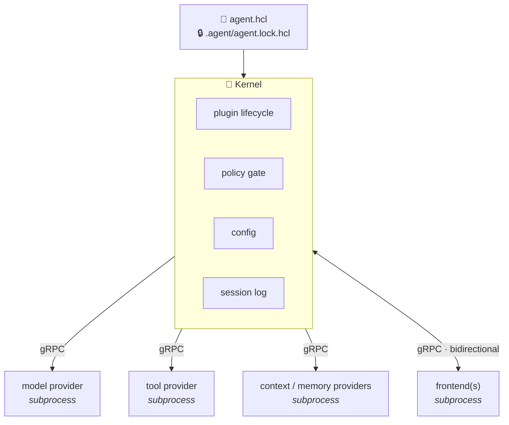

<h1 align="center">⚡ PluggableHarness Agent</h1>

<p align="center"><strong>The AI coding harness you never have to fork.</strong></p>

<p align="center">A real microkernel. Seven plugin categories. One config file. Every opinion is swappable — and none of them are ours.</p>

<p align="center">
  <a href="https://github.com/pluggableharness/agent/releases"></a>
  <a href="LICENSE.md"></a>
  
  
</p>

---

## The pitch

Every AI coding agent on the market is a **monolith wearing a trench coat**. The model vendor is hard-coded. The tools are hard-coded. The way it reads your project conventions, the way it remembers things, the way it paints its UI — hard-coded. Want to change one? Fork the whole thing, and enjoy rebasing forever.

**Terraform solved this exact problem for infrastructure a decade ago**: a small, stable core; providers as versioned, checksummed, out-of-process plugins; one declarative config that wires it all together. Nobody forks Terraform to add a cloud.

**PluggableHarness Agent is that model, applied to AI agents — fused with a Neovim/VSCode-grade hook system for behavior injection.** The kernel ships four primitives — plugin lifecycle, a safety gate in front of every state-changing action, config loading, and a durable per-session log — **and stops there**. Everything that gives an agent its character is a separate, versioned plugin, loaded out-of-process and declared in a single `agent.hcl`.

Nothing is forked to change. It's reconfigured.

## 60 seconds to a running agent

Grab a prebuilt binary from the [releases page](https://github.com/pluggableharness/agent/releases) for Linux, macOS, or Windows — or build from source:

```sh
go install github.com/pluggableharness/agent/cmd/agent@latest
```

Write an `agent.hcl`:

```hcl
required_providers {
  anthropic  = { source = "github.com/pluggableharness/provider-anthropic", version = "~> 1.2" }
  filesystem = { source = "github.com/pluggableharness/provider-filesystem", version = "~> 1.0" }
}

provider "anthropic" {
  api_key = env("ANTHROPIC_API_KEY")
}

provider "filesystem" {
  roots = ["."]
}

policy "auto_approve_reads" {
  match  = { kind = "data_source" }
  action = "allow"
}

agent_profile "default" {
  model {
    primary { provider = "anthropic", id = "claude-opus-4-8" }
  }
  tools = ["filesystem.*"]
}
```

Run it:

```sh
agent run
```

The kernel resolves every provider the profile needs — pinned, checksummed, locked in `.agent/agent.lock.hcl` — launches them as isolated subprocesses, drops you into a session, and gates every mutating action behind a plan you approve before a single byte changes on disk.

## Why this wins

### 🧩 Seven plugin categories. One shape. Learn it once.

| Category | What it owns |
|---|---|
| **Model provider** | The LLM vendor — capabilities, streaming, pricing, thinking modes |
| **Tool provider** | What the agent can *do* — reads, mutations, interactive calls |
| **Context provider** | How your project's conventions get read into the prompt |
| **Memory provider** | What persists across sessions — markdown, sqlite, vector, remote |
| **Frontend provider** | How the session is painted — terminal, web, voice, all at once |
| **Widget provider** | Persistent display state derived from the live event stream |
| **Slashcommand provider** | Direct-invoke commands — a tool-shaped operation in its own right |

Every category speaks the same protocol shape: declare what you do, accept your config, do your work. Master one, and you've mastered all seven.

### 🔒 A plan before anything mutates. No plugin can route around it.

Reads run freely. Mutations get gathered into a **plan**, rendered as a diff, and shown to you before anything executes. The policy engine — `allow` / `ask` / `deny`, with conflict detection — is **kernel-owned**. It is not a plugin. It cannot be unloaded, shadowed, or bypassed by anything you install. Your safety gate doesn't depend on the good behavior of third-party code.

### 💥 Crash-isolated, language-agnostic, secret-safe

Plugins are subprocesses speaking a versioned gRPC contract over `hashicorp/go-plugin` — **the literal library Terraform runs on**. A plugin that crashes doesn't take your session down. A provider can be written in any language. And plugin subprocesses launch with **zero ambient environment** — an explicit allowlist, nothing more — so your secrets are never silently inherited by code you didn't audit.

### 🎨 Write your display logic once. Paint it anywhere.

The Emit → Render → Paint pipeline: a plugin emits an opaque event; the kernel calls back into *that same plugin* to turn it into a display-agnostic tree of text, code, diffs, tables, and interactive actions; whatever frontend is attached — ANSI terminal, HTML, voice — paints that tree its own way. Frontends never need producer-specific knowledge. Multiple frontends can attach to one live session simultaneously.

### 🕰️ Replay with perfect fidelity. Forever.

Every event in the session log records the **exact plugin version** that produced it. Replaying an old session spins up *that version* — not whatever happens to be installed today. No author-written migration functions. No drift. No "this transcript no longer renders." Your history is an asset, not a liability — and the plugin cache is session-log-aware, so a version referenced by retained history is never silently evicted.

### 📦 Providers ship like code, not like packages

A provider is a versioned artifact at a git-forge source — `github.com/org/repo` — constrained with familiar operators (`~>`, `>=`, `=`), resolved through release tags, checksum-verified before caching, and pinned in a lock file. **There is no publishing step beyond `git tag`.** No central registry gatekeeping. No approval queue between your provider and its users.

### 🧮 Budgets and routing are computed, not configured

A model provider declares its real quantitative envelope — context window, thinking modes, caching, pricing. The context budget for every call is **derived at runtime** from whichever model actually resolved: route a sub-agent to a smaller model and it gets a smaller pool automatically. Routing is capability-aware — a model is only eligible for a turn if it genuinely satisfies what that turn needs: context, tool use, vision, thinking. No stale hand-tuned numbers rotting in a config file.

### 🤖 Sub-agents without kernel privilege

"Spawn a sub-agent" isn't sacred kernel code — it's an ordinary tool provider calling the `RunSession` kernel callback, available to *any* plugin, first-party or yours. Sub-agents run under **named, scoped capability profiles** defined in `agent.hcl` — their own model, their own tool set, their own policy overrides, their own depth budget — never an unscoped inheritance of the parent's full power. The session tree persists, so replay reconstructs the whole hierarchy.

## Batteries included

A first-party ecosystem ships alongside the kernel, installed the same way everything else is — as pinned, checksummed dependencies resolved from `agent.hcl`:

- **Four model providers** — [Anthropic](docs/first-party/providers/anthropic.md), [OpenAI](docs/first-party/providers/openai.md), [Google](docs/first-party/providers/google.md), [xAI](docs/first-party/providers/xai.md).
- **A full tool suite** — shell execution with live streaming output, file read/write/edit and multi-file edit, grep and glob search, git, LSP-backed code intelligence, browser automation, web search and fetch, MCP client, sub-agents, task tracking, plan mode, memory persistence, and more. The complete catalog lives in [`docs/first-party/tools/`](docs/first-party/tools/README.md).
- **Reference context, memory, and frontend providers** — so day one is productive, and every one of them is replaceable the moment you disagree with it.

And because context providers stack, the convention-file format war is simply **not our problem**: run a CLAUDE.md reader and an AGENTS.md reader side by side. It's a plugin choice, not a core opinion.

## Tested end to end

The kernel, the plugin runtime, and every first-party provider carry unit coverage for their own logic **plus integration suites that run real plugin subprocesses over the actual gRPC wire contract** — not mocks standing in for the handshake. Replay is tested the same way sessions are produced: recorded, re-rendered from the log, and checked against the original output. Nothing ships without both directions of that path passing.

## Architecture in one breath



Small core. Versioned contracts. Everything with an opinion lives outside the kernel — where you can replace it.

## Documentation

- [`docs/specifications/`](docs/specifications/README.md) — the authoritative protocol and kernel-contract documentation: the architecture narrative, terminology, and the normative contract for every plugin category plus the kernel's own behavior — the turn loop, `agent.hcl`, the policy DSL, kernel callbacks, session persistence and replay.
- [`docs/first-party/`](docs/first-party/tools/README.md) — the first-party tool catalog and model-provider reference material.

Building a third-party provider? `docs/specifications/` is the contract to build against — each category defines exactly what "correctly implements the protocol" means.

## Contributing

Issues and pull requests are welcome — bug reports, new provider proposals, and protocol refinements alike. The whole point of this architecture is that the most valuable contributions don't even need to land in this repo: **build a provider, tag a release, and it's installable.**

## License

Apache License 2.0 — see [`LICENSE.md`](LICENSE.md).

---

<p align="center"><strong>Stop forking your agent. Start configuring it.</strong></p>
